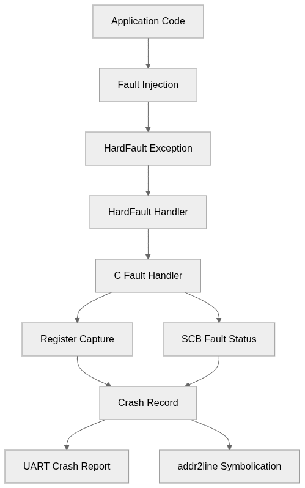
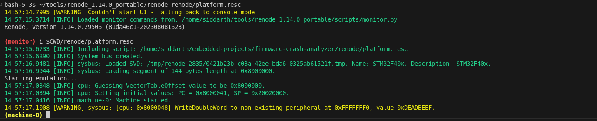
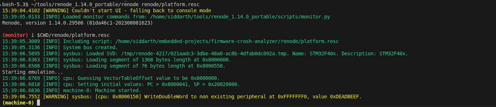
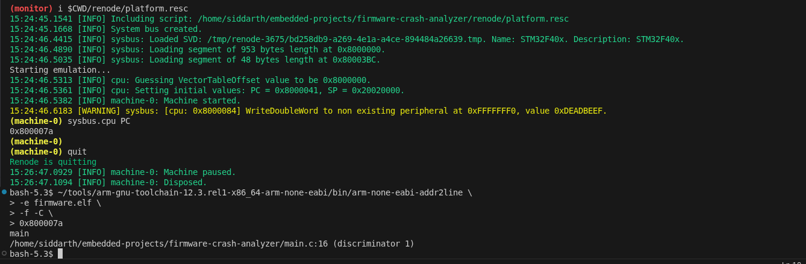
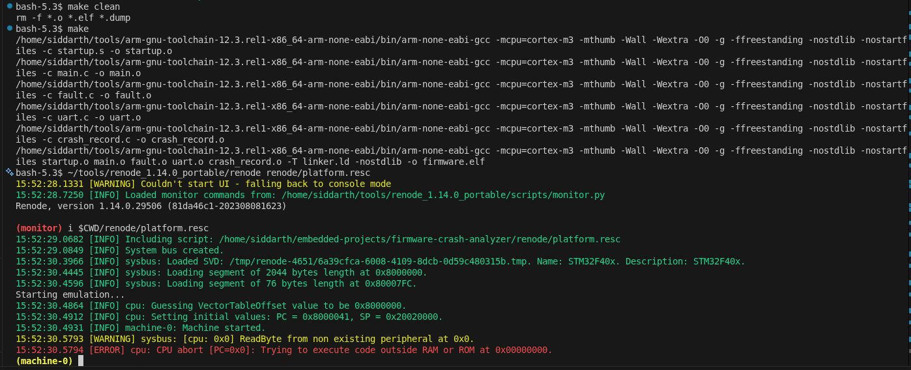

🚨 Firmware Crash Analyzer (Silicon-Grade Debugging)

Deterministic HardFault analysis for ARM Cortex-M using Renode

A production-style firmware crash analysis framework that captures CPU state, fault status registers, and root cause, supports post-mortem symbolication, and runs entirely in a hardware-free emulated SoC environment.

  
  
  
  
  

🎯 Why this project made,

In real silicon teams (automotive, aerospace, medical, SoC validation), crash analysis must work without a debugger attached.

This project demonstrates:

how HardFaults are handled in production firmware

how to extract meaningful diagnostics after a crash

how to reproduce faults deterministically using Renode

🧠 High-Level Architecture,

Crash Flow Summary

Application executes normally

Invalid memory access is intentionally triggered

Cortex-M raises a HardFault exception

Assembly handler captures the active stack pointer

C fault handler:

extracts stacked CPU registers

reads SCB fault status registers

stores crash info persistently

Crash report is printed over UART

PC is symbolicated offline using addr2line

🧱 System Block Diagram

The following diagram shows the complete crash handling and post-mortem analysis flow implemented in this project:

🧪 Simulation Environment

Emulator: Renode

CPU: ARM Cortex-M (STM32F4 model)

Toolchain: arm-none-eabi-gcc

Host OS: Linux (Fedora)

Simulation config lives here:

sim/renode/platform.resc

📸 Execution Evidence (Screenshots)

### 1️⃣ Firmware Build Success

Confirms clean compilation and correct ELF generation using `arm-none-eabi-gcc`.

### 2️⃣ Deterministic Fault Injection (Renode)

An intentional invalid write to `0xFFFFFFF0` triggers a **precise BusFault** in the emulated Cortex-M system.

### 3️⃣ Post-Mortem Symbolication

Captured program counter (PC) is symbolicated offline using `addr2line`, resolving the crash to:
- exact function
- exact source file and line number

This mirrors real **post-silicon debug workflows**.

### 4️⃣ Emulator vs Real Silicon Behavior

Demonstrates how Renode detects illegal execution paths early, making it ideal for **fault injection, CI testing, and safety validation**.

🧾 Crash Data Captured

On fault, the firmware captures:

CPU registers

R0–R3, R12, LR, PC, xPSR

SCB fault registers

CFSR (fault classification)

HFSR

BFAR / MMFAR

Persistent crash record

Survives reset

Can be dumped on next boot

🔍 Post-Mortem Analysis (Host Side)
arm-none-eabi-addr2line \
  -e firmware.elf \
  -f -C \
  0x0800007a

Output:

main
main.c:16

👤 Author

Siddarth S
Embedded / Firmware Engineer
ARM Cortex-M · Bare-Metal · Debug Infrastructure